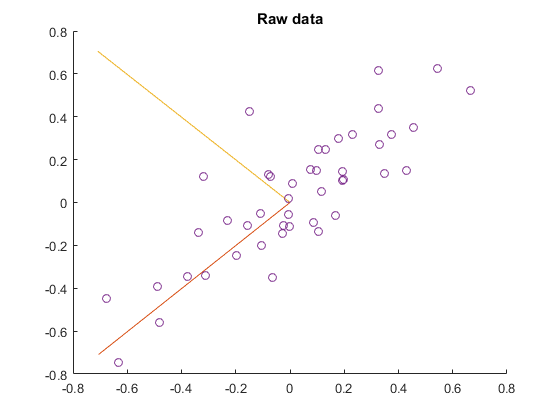

---
title: '无监督学习实践1 - PCA与白化'
...

Preprocessing: PCA and Whitening

主成分分析(PCA)
===============

[PCA](http://deeplearning.stanford.edu/wiki/index.php/PCA)

白化(Whitening)
===============

[Whitening](http://deeplearning.stanford.edu/wiki/index.php/Whitening)

白化的目的就是降低输入的冗余性，即想通过白化过程使得输入：

1.  特征间的相关性较低; (PCA)
2.  所有特征具有相同的方差. ($1\over\sqrt{\lambda_i+\epsilon}$缩放)

PCA已经使得数据间的相关性降低，为使每个输入特征具有单位方差，用$1\over\sqrt{\lambda_i+\epsilon}$作为缩放因子（$\epsilon$用于**正则化**，防止分母为零，导致数据上溢到无穷，同时具有平滑即低通滤波作用），缩放每个特征$x_{rot,i}$，即PCA白化后的数据$x_{PCAwhite}$满足：

$$x_{PCAwhite,i}={x_{rot,i}\over\sqrt{\lambda_i+\epsilon}}, \space i代表成分或维度$$

PCA白化后的数据已经具有单位协方差，ZCA白化是在PCA白化的基础上，左乘一个任意正交矩阵$R$（$RR^{T}=R^{T}R=I$，也可以是旋转或反射矩阵），那么处理后的数据**仍然具有单位协方差**，在ZCA白化中，取PCA投影矩阵$R=U$，则：

$$x_{ZCAwhite}=Ux_{PCAwhite}$$

这种旋转使得$x_{ZCAwhite}$尽可能的接近原始数据$x$.

PCA/Whitening 计算步骤
======================

[Implementing
PCA/Whitening](http://deeplearning.stanford.edu/wiki/index.php/Implementing_PCA/Whitening)

1.  使数据均值为零;
2.  计算协方差矩阵;
3.  计算协方差矩阵的特征值和特征向量;
4.  使用特征向量组成的**PCA变换矩阵**$U$（旋转矩阵，按特征值大小*降序*且按列排）旋转数据，得到**PCA变换**后的数据$x_{rot}$，取前$k$个特征向量组成旋转矩阵旋转数据，得到**PCA降维**后的数据（假设输入$x\in R^n, \space k<n$）;
5.  使用$1\over\sqrt{\lambda_i+\epsilon}$对PCA旋转后的数据缩放，使其具有相同单位协方差，得到**PCA白化**后的数据$x_{PCAwhite}$;
6.  对PCA白化后的数据，左乘PCA变换矩阵得到**ZCA白化**后的数据$x_{ZCAwhite}$.

二维数据PCA实验
===============

[Exercise:PCA\_in\_2D](http://deeplearning.stanford.edu/wiki/index.php/Exercise:PCA_in_2D)

**MATLAB实现：**

-   使数据均值为零：（提供的二维数据以具有相同均值0，此步省去）

    ~~~~ {.sourceCode .matlab}
    avg = mean(x, 1);
    x = x - repmat(x, 1);
    ~~~~

-   计算协方差矩阵：

    ~~~~ {.sourceCode .matlab}
    sigma = cov(x', 1); % MATLAB function, '1' normalize with n
    sigma = x*x'/size(x, 2); % or you can use this code
    ~~~~

    原始数据协方差：

    ~~~~ {.sourceCode .matlab}
    sigma =
        0.0883    0.0733
        0.0733    0.0890
    ~~~~

-   计算协方差矩阵的特征值和特征向量：

    ~~~~ {.sourceCode .matlab}
    [U, S, ~] = svd(sigma);
    ~~~~

原始二维数据及其协方差矩阵的特征向量

~~~~ {.sourceCode .matlab}
U =
   -0.7055   -0.7087
   -0.7087    0.7055
S =
    0.1620         0
         0    0.0154
~~~~

-   PCA变换旋转数据$x$得到$x_{rot}$：

    ~~~~ {.sourceCode .matlab}
    xRot = U'*x;
    ~~~~

PCA旋转后的数据

-   PCA降维数据:

~~~~ {.sourceCode .matlab}
xRot = U(:,1:k)'*x; % projecting to 1 dimension
xHat = U(:,1:k)*xRot; % projecting the xRot back
~~~~

PCA降维 - 旋转后映射回的数据

-   PCA白化：

~~~~ {.sourceCode .matlab}
xPCAWhite = diag(1./sqrt(diag(S)+epsilon))*U'*x; % xPCAWhite_i = xRot_i/sqrt(lambda_i)

sigmaPCAWhite = cov(xPCAWhite', 1); % computes the covariance of PCAWhite data
~~~~

PCA降维 - PCA白化后的数据

~~~~ {.sourceCode .matlab}
sigmaPCAWhite =
    0.9921    0.0066
    0.0066    0.9937
~~~~

-   ZCA白化：

~~~~ {.sourceCode .matlab}
xZCAWhite = U*diag(1./sqrt(diag(S)+epsilon))*U'*x; % xZCAWhite_i = U*xPCAWhite

sigmaZCAWhite = cov(xZCAWhite', 1); % computes the covariance of ZCAWhite data
~~~~

ZCA降维 - ZCA白化后的数据

~~~~ {.sourceCode .matlab}
sigmaZCAWhite =
    0.9996   -0.0008
   -0.0008    0.9863
~~~~

PCA与白化图像数据实验
=====================

[Exercise:PCA and
Whitening](http://deeplearning.stanford.edu/wiki/index.php/Exercise:PCA_and_Whitening)

PCA实验
-------

当把PCA应用于图像时，有点疑惑的是，按照协方差的公式：

$$Cov(X,Y)=E[(X-E[X])(Y-E[Y])] ,$$

减去的均值应该是所有样本的均值.
这样，对于图像块矩阵$\rm{x}_{n \times m}$，其中，$n$为一个样本的特征维度即一个图像块拉成列向量的维度，$m$为图像块的数目，求其特征维上的协方差时，均值应该这样求：$\overline{\rm x}={1\over m}\sum_{i=1}^{m}{{\rm x}^{(i)}}$，而教程中是这样求的：$\overline{{\rm x}^{(i)}}={1\over n}\sum_{j=1}^{n}{{\rm x}^{(i)}_j}$，即每个块求均值.
文中说我们对图像块的平均亮度值不感兴趣，所以可以减去这个值进行均值规整化.

> So, we won’t use variance normalization. The only normalization we
> need to perform then is mean normalization, to **ensure that the
> features have a mean around zero**. Depending on the application, very
> often we are not interested in how bright the overall input image is.
> For example, in object recognition tasks, the overall brightness of
> the image doesn’t affect what objects there are in the image. **More
> formally, we are not interested in the mean intensity value of an
> image patch; thus, we can subtract out this value, as a form of mean
> normalization**.

PCA白化实验
-----------

[Exercise: PCA
Whitening](http://ufldl.stanford.edu/tutorial/unsupervised/ExercisePCAWhitening)

**一点说明**：教程中叙述的与展示的实验结果图不一致：文中叙述的是$144\times10000$的矩阵（与Wiki上的教程一致），实验数据集却是手写体$784\times60000$，这里也用手写体数据，可以到[THE
MNIST DATABASE](http://yann.lecun.com/exdb/mnist/)下载.

-   零均值化数据

这里处理的是手写体图像，所以求得是每个图像块（patch）的均值.

~~~~ {.sourceCode .matlab}
% avg = mean(x, 1);
% x = x - repmat(avg, size(x,1), 1);
x = bsxfun(@minus, x, mean(x,1)); % or this code
~~~~

手写体数据及零均值化数据示意

-   旋转数据：

~~~~ {.sourceCode .matlab}
sigma = x*x'/m; % n-by-n
[u, s, ~] = svd(sigma);
xRot = u'*x;% n-by-m
~~~~

-   验证PCA实现的正确性，即旋转数据的协方差仅对角元素非零：

~~~~ {.sourceCode .matlab}
covar = xRot*xRot'/m; % the mean of xRot is 0
~~~~

手写体数据旋转后数据的协方差

-   寻找保留主成分数目：

保留方差百分比：99%：

~~~~ {.sourceCode .matlab}
lambda = diag(s);
lambda_sum = sum(lambda);
lambda_sumk = 0;
perc = 0;
k = 0;
while perc < 0.99
    k = k + 1;
    lambda_sumk = lambda_sumk + lambda(k);
    perc = lambda_sumk / lambda_sum;
end
~~~~

-   维数约简与重构：

~~~~ {.sourceCode .matlab}
xDimk = u(:,1:k)'*x;
xHat = u(:,1:k)*xDimk;
~~~~

PCA维数约简后重构的图像 (采用每个图像块的均值零均值化图像,
方差保留百分比：99.01%，784 -\> 300)

如果零均值化过程，采用所有图像块的均值，则零均值化后的图像和PCA重构后的图像如下图所示：

PCA维数约简后重构的图像 (采用所有图像块的均值零均值化图像,
方差保留百分比：99.01%，784 -\> 300)

-   PCA白化及检验：

通过观察白化后数据的协方差矩阵，分别使用不同的值正则化和不使用正则化（epsilon近似为0）：

~~~~ {.sourceCode .matlab}
epsilon = 1e-1;
%%% YOUR CODE HERE %%%
xPCAWhite = diag(1./sqrt(diag(s)+epsilon))*u'*x;
~~~~

白化后数据的协方差矩阵

-   ZCA白化：

~~~~ {.sourceCode .matlab}
xZCAWhite = u*diag(1./sqrt(diag(s)+epsilon))*u'*x;
~~~~

ZCA维数约简后重构的图像
